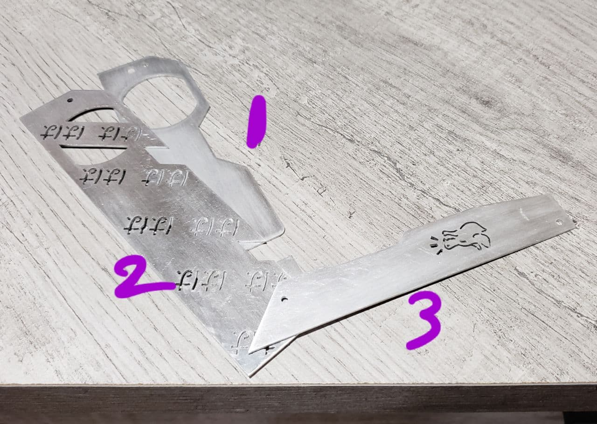
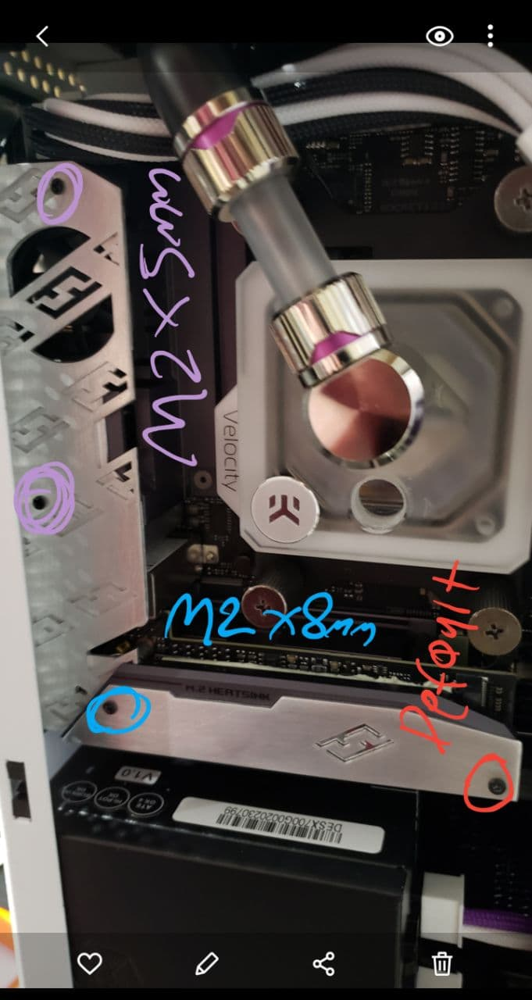

# strix-x570i-shield
 
Files for making your own custom I/O and M2 shield for the ASUS Strix x570i motherboard!

# Perform this mod at your own risk!!!
This may have worked for me, but I make no guarantee. That rhymes, please do not commmit crimes. 

## Components
There are three main components involved
1. IO Base
2. IO Shield
3. M2 Shield
4. Additional M2 screws (2x `M2 x 5mm` and 1x `M2 x 8mm`)

I've found that **1.0mm** aluminum works well for all three pieces.

## File Types Included
- `.svg` and `.eps`
- `.afdesign` for editing with Affinity Designer
- `.FCstd` for editing with FreeCAD

## Assembly Steps
1. Remove the M2 heatsink. Carefully remove the top layer of the M2 heatsink. Light use of heatgun or hairdryer helps, as its attached with some sort of adhesive.
2. Remove default plates to expose the IO/VRM heatsink.
3. Attach the new IO plates in the order of the first image. Use two screws at this step (M2 x 5mm)

4. Re-attach the now bare M2 heatsink, and align the shared screw hole
5. Use the second image to secure the plates to the IO/VRM heatsink and M2 heatsink. You can reuse one of the default screws, but you'll need an additional screw (M2 x 8mm)

